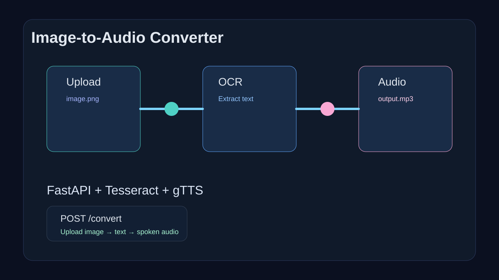
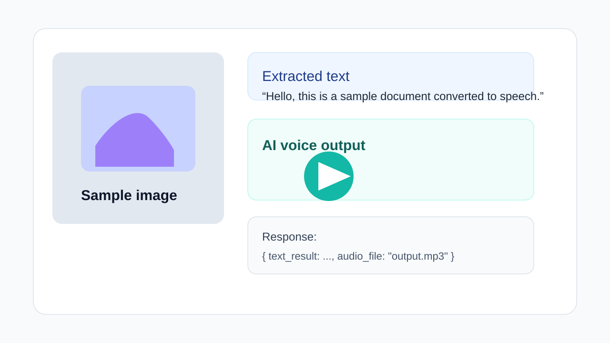

# Image-to-Audio Converter API

A FastAPI-based application that converts images containing text into audio files using OCR and text-to-speech technology.

## 🎯 Features

- **OCR Processing**: Extract text from images using Tesseract OCR
- **Text-to-Speech**: Convert extracted text to natural-sounding audio using Google Text-to-Speech (gTTS)
- **REST API**: Simple POST endpoint for image processing
- **CORS Enabled**: Ready for frontend integration
- **Error Handling**: Robust exception handling for production use

## 📋 Project Structure

```
Simple-Api/
├── backend/
│   └── main.py           # FastAPI application
├── docs/
│   └── screenshots/      # API workflow & demo visualizations
├── frontend/
│   ├── Animation_Project.html
│   ├── Animation_Project.css
│   └── Animation_project.js
├── requirements.txt      # Python dependencies
├── .gitignore           # Git ignore rules
└── README.md            # This file
```

## 🔧 Tech Stack

- **Backend**: FastAPI + Uvicorn
- **OCR**: Tesseract-OCR via pytesseract
- **TTS**: Google Text-to-Speech (gTTS)
- **Image Processing**: Pillow (PIL)

## 📦 Installation

### Prerequisites
- Python 3.8+
- Tesseract-OCR installed ([Installation Guide](https://github.com/UB-Mannheim/tesseract/wiki))

### Setup

1. **Clone the repository**
   ```bash
   git clone https://github.com/vishnu-vemula/Simple-Api.git
   cd Simple-Api
   ```

2. **Create a virtual environment**
   ```bash
   python -m venv venv
   source venv/bin/activate  # On Windows: venv\Scripts\activate
   ```

3. **Install dependencies**
   ```bash
   pip install -r requirements.txt
   ```

4. **Configure Tesseract path** (if needed)
   - Update the path in `backend/main.py`:
   ```python
   pytesseract.pytesseract.tesseract_cmd = r"C:\Program Files\Tesseract-OCR\tesseract.exe"
   ```

## 🚀 Usage

### Start the API Server

```bash
uvicorn backend.main:app --reload
```

The API will be available at `http://localhost:8000`

### API Documentation

Once running, visit:
- **Swagger UI**: http://localhost:8000/docs
- **ReDoc**: http://localhost:8000/redoc

### API Endpoint

**POST** `/convert`

Upload an image containing text to extract and convert to audio.

**Request:**
```bash
curl -X POST "http://localhost:8000/convert" \
  -H "accept: application/json" \
  -F "file=@image.png"
```

**Response:**
```json
{
  "text_result": "Extracted text from the image",
  "audio_data": "output.mp3"
}
```

## 📸 API Workflow

### Flow Diagram
```
Image Upload → Tesseract OCR → Text Extraction → gTTS Processing → Audio Output
```



### Example Demo


## ⚙️ Configuration

### CORS Settings
By default, CORS is enabled for `http://localhost:3000`. Update this in `backend/main.py`:

```python
app.add_middleware(
    CORSMiddleware,
    allow_origins=["http://localhost:3000"],  # Add your frontend URL
    allow_credentials=True,
    allow_methods=["*"],
    allow_headers=["*"],
)
```

### Supported Languages (for gTTS)
The API currently supports English (`en`). To add more languages:

```python
tts = gTTS(text=text_result, lang='fr')  # French
```

## 🐛 Troubleshooting

| Issue | Solution |
|-------|----------|
| Tesseract not found | Ensure Tesseract is installed and path is correct in `main.py` |
| CORS errors | Check `allow_origins` in CORS middleware configuration |
| File upload fails | Verify file format is supported (PNG, JPG, etc.) |
| No text extracted | Ensure image quality is good and text is clear |

## 📚 Dependencies

| Package | Version | Purpose |
|---------|---------|---------|
| fastapi | >=0.110.0 | Web framework |
| uvicorn | >=0.29.0 | ASGI server |
| pillow | >=10.0.0 | Image processing |
| pytesseract | >=0.3.10 | OCR interface |
| gtts | >=2.5.1 | Text-to-speech |
| python-multipart | >=0.0.9 | Form data parsing |

## 🎨 Frontend

Includes animated portfolio/studio website with smooth scroll interactions using GSAP and Locomotive Scroll.

**Files:**
- `Animation_Project.html` - Markup
- `Animation_Project.css` - Styles
- `Animation_project.js` - Interactivity & animations

## 📝 License

This project is open source and available under the MIT License.

## 🤝 Contributing

Contributions are welcome! Please feel free to submit a Pull Request.

## 👤 Author

**Vishnu Vemula**

- GitHub: [@vishnu-vemula](https://github.com/vishnu-vemula)
- Repository: [Simple-Api](https://github.com/vishnu-vemula/Simple-Api)

---

**Last Updated:** September 2026